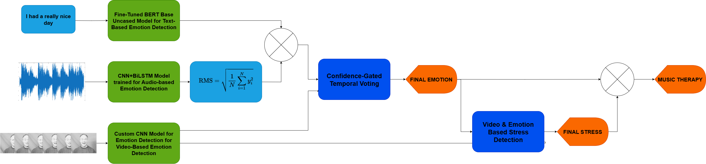

---

## **Multimodal Emotion Recognition & Stress-Aware Music Therapy**

### **Overview**

This project detects emotions and stress levels in **real-time** using text, audio, and video inputs, then generates **personalized therapeutic music** using AI. It’s designed for mental health support, emotion-aware apps, and adaptive ambient music systems.

---

### **Features**

* **Multimodal Emotion Recognition:** Text (BERT), Audio (CNN-BiLSTM), Video (Custom CNN)
* **Stress Analysis:** Uses emotional variability and inertia for accurate stress scoring
* **Real-Time Music Generation:** Creates adaptive music loops using Meta’s MusicGen

---

### **Installation & Usage**

1. **Clone the repository**

   ```bash
   git clone https://github.com/reethveekO-o/Multi-Modal-Emotion-Recognition-and-Music-Therapy-Generation
   cd Multi-Modal-Emotion-Recognition-and-Music-Therapy-Generation
   ```

2. **Make sure you are using Python version** `>=3.9` **and** `<3.12`.
   You can check your version with:

   ```bash
   python --version
   ```

3. **Install the requirements**

   ```bash
   pip install -r requirements.txt
   ```

4. **Run the complete pipeline**

   ```bash
   python main.py
   ```

5. **Run specific modules**

   * **Emotion generation only:**

     ```bash
     python emotion_final.py
     ```
   * **Stress generation only:**

     ```bash
     python stress_final.py
     ```
   * **Extra components** (for individual functionalities like audio+text emotion prediction, video emotion prediction, prompt generation for MusicGen, or mode extraction) are available inside the **extras/** folder.

---

## Architecture


The system follows a multimodal pipeline:  
1. **Input:** Accepts text, audio, and video as inputs.  
2. **Emotion Recognition:** Each modality is processed by its own model  
   - Text → BERT-based Transformer  
   - Audio → CNN-BiLSTM with Cross-Attention  
   - Video → Custom CNN with frame-wise analysis  
3. **Fusion:** Outputs are combined using **Hierarchical Fusion with Adaptive Certainty Weighting (HF-ACW)** to prioritize the most reliable modalities.  
4. **Stress Analysis:** Calculates stress using emotional variability, inertia, and semantic cues from text.  
5. **Music Generation:** Builds a prompt based on emotion and stress scores and generates adaptive therapeutic music using **MusicGen**.  



Individual components and their scripts:  
- **Full Pipeline:** `main.py`  
- **Emotion Generation Only:** `emotion_final.py`  
- **Stress Generation Only:** `stress_final.py`  
- **Extras Folder:** Contains individual modules like audio+text emotion prediction (`audiotext_pred.py`), video emotion prediction (`video_pred.py`), prompt generation (`prompt_gen.py`), and mode extraction (`modalextraction.py`).  

---

### **Contributing**

Pull requests and suggestions are welcome!

---

### **Acknowledgements**

Built at **CDSAML, PES University** during June–July 2025.

---
